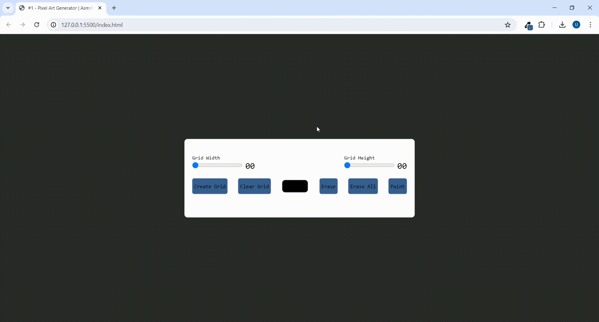

# Pixel Art Generator
This JavaScript code implements a grid drawing application with features like dynamic grid creation, drawing with color selection, and erasing. It utilizes DOM manipulation, event listeners for user interactions, and conditional logic to control drawing and erasing functionalities. Additionally, it detects the device type to handle touch and mouse events differently, demonstrating a comprehensive understanding of web development concepts.

